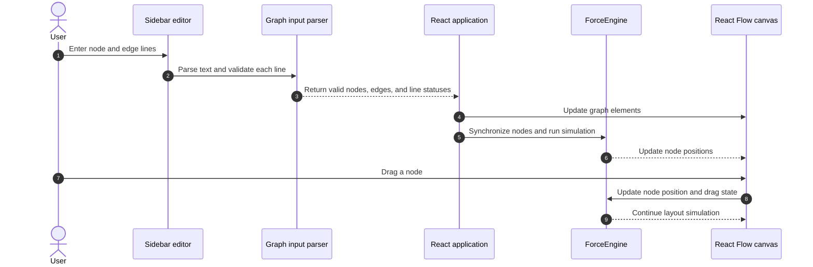

<div align="center">

# Graph Visualizer

**Build and explore interactive graphs by describing nodes and edges as text.**

[](https://react.dev/)
[](https://www.typescriptlang.org/)
[](https://fastapi.tiangolo.com/)
[](https://vite.dev/)

</div>

---

## Problem & Motivation

Understanding the shape of a graph is easier when its structure is visible. Graph Visualizer turns a small text description into a draggable graph, arranging nodes with a force-directed simulation as you edit.

The frontend owns graph parsing, rendering, and layout. The accompanying FastAPI backend currently provides a welcome route and health check, leaving a foundation for future API-backed graph features without making the editor depend on a server for its current behavior.

## Key Features

- **Text-based graph definition:** Define standalone nodes and edges one per line.
- **Live graph updates:** The canvas reflects valid input as it is typed.
- **Inline validation:** Invalid input lines are marked in the editor gutter.
- **Force-directed layout:** Nodes repel one another and are pulled toward the canvas center.
- **Direct manipulation:** Drag nodes; the layout simulation responds to their new positions.
- **Graph overview:** The sidebar reports active node and edge counts.
- **Responsive sidebar:** The editor panel adapts to narrow screens.
- **FastAPI health endpoint:** Check backend availability and inspect its generated API docs.

## Architecture & How It Works



## Tech Stack

| Category | Technology |
| --- | --- |
| Frontend | React 19, TypeScript, Vite |
| Graph canvas | [`@xyflow/react`](https://reactflow.dev/) |
| Icons | [`lucide-react`](https://lucide.dev/) |
| Linting | Oxlint |
| Backend | Python, FastAPI, Uvicorn |
| API documentation | FastAPI OpenAPI, Swagger UI, and ReDoc |

## Getting Started

### Prerequisites & Environment Setup

#### 1. Install Python

Download Python 3.10 or newer from the official [Python downloads page](https://www.python.org/downloads/). On Windows, run the installer and select **Add python.exe to PATH** before installing. Reopen your terminal after setup and check the version:

```powershell
python --version
```

The command should report Python 3.10 or newer.

#### 2. Install Node.js and npm

Download and install Node.js 20.19+ or 22.12+ from the official [Node.js download page](https://nodejs.org/en/download). Choose an LTS release that meets one of those version requirements. npm is included with the Node.js installer. Reopen your terminal and verify both commands:

```powershell
node --version
npm --version
```

Node.js must be version 20.19+ or 22.12+ because the frontend uses Vite 8.

#### 3. Set up and start the backend

From the repository root, create a virtual environment and install the pinned dependencies.

PowerShell:

```powershell
cd backend
python -m venv .venv
.\.venv\Scripts\Activate.ps1
python -m pip install -r requirements.txt
python run.py
```

Command Prompt:

```bat
cd backend
python -m venv .venv
.venv\Scripts\activate
python -m pip install -r requirements.txt
python run.py
```

The development API listens at `http://127.0.0.1:8000` with Uvicorn reload enabled.

#### 5. Set up and start the frontend

Open a second terminal at the repository root:

```powershell
cd frontend
npm install
npm run dev
```

Open the Vite URL shown in the terminal, normally `http://localhost:5173`.

The backend CORS policy allows the default Vite origin, `http://localhost:5173`. If Vite selects a different port, add that origin to `allow_origins` in [`backend/app/main.py`](backend/app/main.py).

### Graph Input Format

Enter one node or edge per line:

```text
A
B
C
A B
B C
```

A single label defines a standalone node. Two labels separated by one space define an undirected-looking visual connection; both endpoint nodes are added automatically if needed.

Input rules:

- Node labels must be 1 to 3 characters and contain no whitespace.
- Edge lines must contain exactly two labels separated by one space.
- Self-edges such as `A A` are invalid.
- Duplicate standalone node definitions are invalid.
- Duplicate edges are invalid regardless of order (`A B` and `B A` are duplicates).
- Empty lines are allowed.
- Invalid lines show an error marker and do not contribute graph elements.

### Build

From the `frontend/` directory, run the production type-check and build:

```powershell
npm run build
```

This runs `tsc -b` followed by `vite build`. The static site is generated in `frontend/dist/`.

### Preview the production build

After building, run:

```powershell
npm run preview
```

Vite prints the local preview URL. The frontend can be hosted as static assets; the backend is a separate service.

## Configuration

### Force layout

The default simulation parameters are defined in [`frontend/src/physics/forceEngine.ts`](frontend/src/physics/forceEngine.ts):

```typescript
center: { x: 350, y: 300 },
repulsion: 8000,
minDistance: 35,
centerGravity: 0.02,
damping: 0.82,
stopThreshold: 0.04,
```

Adjust these values to change node spacing, attraction toward the center, and how quickly the simulation settles.

### Backend CORS and routes

CORS origins are configured in [`backend/app/main.py`](backend/app/main.py). The current API exposes:

| Method | Path | Purpose |
| --- | --- | --- |
| `GET` | `/` | Welcome message. |
| `GET` | `/api/health` | Service status. |
| `GET` | `/docs` | Interactive Swagger UI. |
| `GET` | `/redoc` | ReDoc API reference. |

Check backend health with PowerShell:

```powershell
Invoke-RestMethod http://127.0.0.1:8000/api/health
```

Expected response:

```json
{
  "status": "ok",
  "message": "Graph Visualizer API is running"
}
```

## Notes

- Graph input is parsed entirely in the frontend; graph data is not sent to or stored by the backend.
- The backend currently has no database, authentication, or graph-processing routes.
- The force layout is implemented in the frontend and uses pairwise node repulsion and center gravity.
- Frontend scripts are available from `frontend/`: `npm run dev`, `npm run build`, `npm run lint`, and `npm run preview`.
- No frontend test suite is currently configured.

## License & Author

- **Author:** Not specified in the repository metadata.
- **License:** No license file is currently included in this repository.
